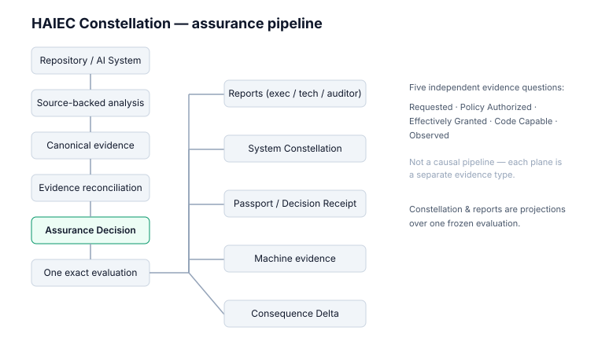

# Architecture

HAIEC Constellation — source-backed assurance for consequential AI actions.



```
Repository / AI System
        │
        ▼
Source-backed analysis  (static evidence — what the code can reach)
        │
        ▼
Canonical evidence  (typed relations: capability, dispatch, handler,
                     operation, resource, control, context binding)
        │
        ▼
Evidence reconciliation  (one evaluation binds one source snapshot)
        │
        ▼
Assurance Decision  (ALLOW / REVIEW / BLOCK — bounded to evaluated scope)
        │
        ▼
One exact evaluation ────────────────────────────────┐
        │                                           │
        ▼                                           ▼
Reports            System Constellation            Passport / Decision Receipt
(exec/tech/audit)  (evaluation snapshot vs current)  Machine evidence
                                                     Consequence Delta
```

## The five planes are questions, not stages

`Requested · Policy Authorized · Effectively Granted · Code Capable · Observed`
are **independent evidence planes**. Each is a distinct evidence type with
distinct limitations — they are not a causal runtime sequence, and one plane's
state never implies another's.

## The path model

```
Source Context → Capability Exposure → Dispatch → Implementation
      → Handler → Service / Resource → Consequence
```

Authority, control, and context-binding evidence attach around the path —
they do not silently upgrade it.

## Projection boundaries

- Constellation is a **projection** over evidence, not a truth engine.
- Reports are **presentations** of one frozen evaluation — many profiles, one
  truth.
- Public demo artifacts are **sanitized projections** — redaction never alters
  evidence state.
- Missing runtime evidence is never presented as proof of non-occurrence.

## Key invariants

- `SOURCE_REACHABLE != EXECUTED` — a static path is not a runtime event.
- `REGISTERED != MODEL_VISIBLE`, `MODEL_VISIBLE != DISPATCHED`.
- `CODE_CAPABLE != POLICY_AUTHORIZED != EFFECTIVELY_GRANTED != OBSERVED`.
- `RESOURCE_NAME != EFFECT_VERB` — consequence labels come from the actual
  operation at the exact frozen source line, never from naming heuristics.
- `UNKNOWN != SAFE` — unknowns stay unknown, explicitly.
